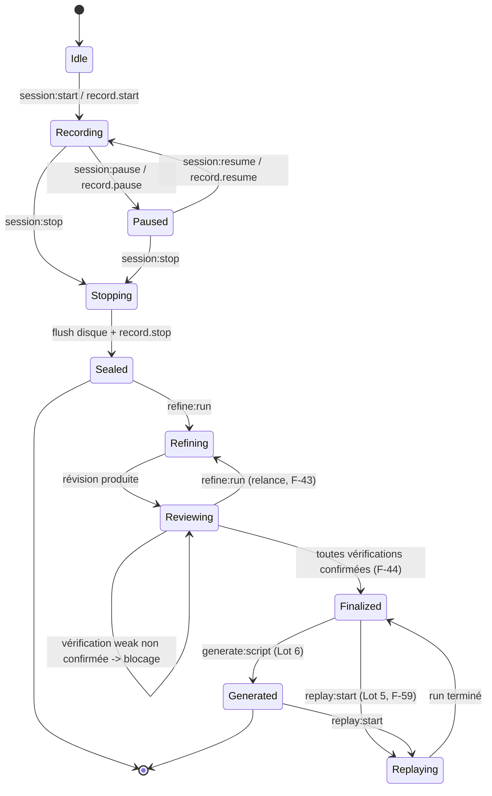
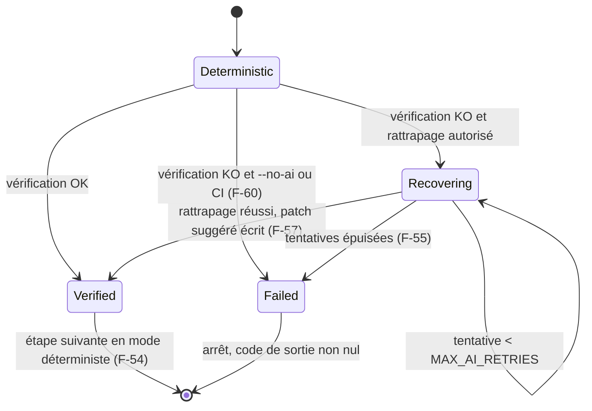

# Machine à états de l'orchestrateur de session

Composant central de 6.2. Une seule instance par fenêtre. Toute transition est journalisée
dans `raw.jsonl` sous un `kind` de la famille `record.*`.

## Invariants

| # | Invariant |
|---|---|
| S-1 | `Sealed` est terminal pour l'artefact brut : aucune écriture dans `raw.jsonl` après cet état (F-40). |
| S-2 | La transition `Reviewing → Finalized` est **refusée** tant qu'une vérification `weak` n'est pas confirmée (F-44, ADR-0007). |
| S-3 | Une perte de réseau ne provoque **aucune** transition. Elle n'affecte que le mode de narration (F-23). |
| S-4 | `Recording → Stopping` attend le vidage du tampon d'écriture avant `Sealed`. Un arrêt brutal laisse `raw.jsonl` valide jusqu'à la dernière ligne complète. |
| S-5 | `Refining` requiert le profil `smart` joignable ; son indisponibilité empêche d'entrer dans cet état, jamais d'en sortir. `Replaying` déterministe (F-50, F-60) n'exige pas de clé. Seul le sous-état `Recovering` exige `smart` (F-52). |

## Sous-machine d'exécution d'une étape (lot 5)

