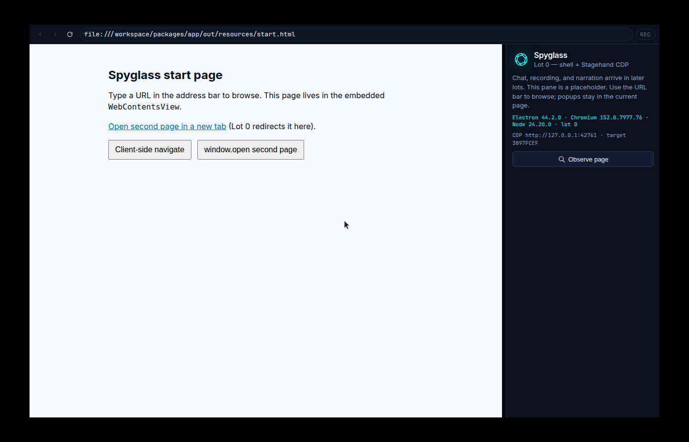
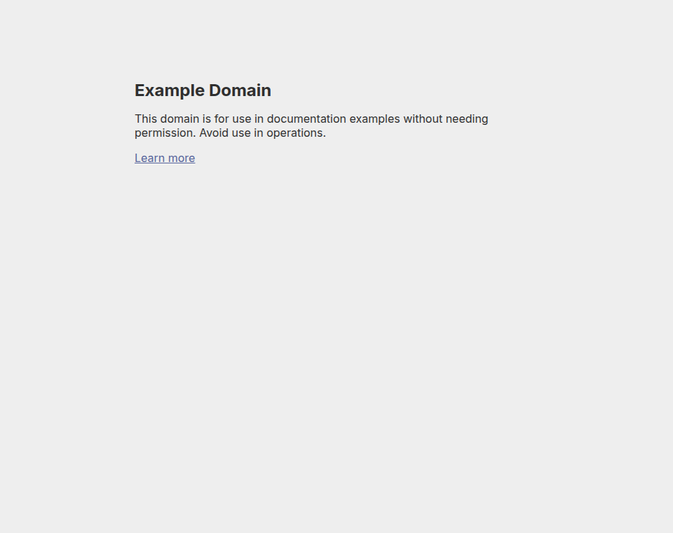
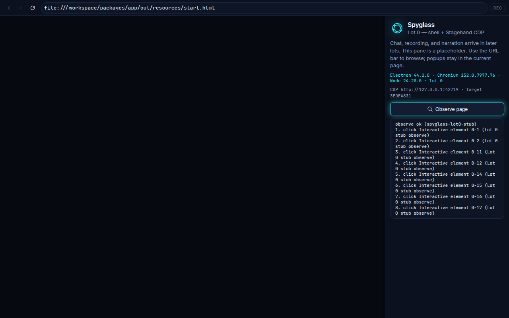

# Lot 0 evidence and PR notes

Do **not** open the pull request from this lot unless a human asks. This file
is the hand-off for a later PR.

## CDP (packaged vs dev)

Remote debugging is **off** in electron-builder artifacts unless
`SPYGLASS_CDP=1` or `SPYGLASS_OBSERVE_ON_START=1`. Unpackaged runs (`pnpm start`,
`pnpm dev`, e2e) enable it by default so this lot's Observe proof still works
without extra flags. `SPYGLASS_CDP=0` forces it off.

In-app Observe is part of the packaged app: `scripts/stagehand-observe.mjs` is
listed in `electron-builder.yml` (`files` + `extraResources` + `asarUnpack`)
and `@browserbasehq/stagehand` / `playwright-core` / `zod` are production
dependencies. Launch a packaged binary with `SPYGLASS_CDP=1` to use Observe.

Guest navigation is deny-by-default (`will-navigate` / `will-frame-navigate`).
`file:` popups/`loadURL` are refused when the current guest is http(s); start
page → `second.html` (F-04) still works. `browserBounds` from the renderer are
clamped to the window content size and cannot cover the 40px URL bar.

## Screenshots (committed)

| Relative path | What it shows |
| --- | --- |
| [`screenshots/two-zone-shell.png`](screenshots/two-zone-shell.png) | Two-zone shell: URL bar, nav controls, start page in `WebContentsView`, chat placeholder |
| [`screenshots/guest-start-page.png`](screenshots/guest-start-page.png) | Guest page DOM inside the `WebContentsView` |
| [`screenshots/navigated-webcontentsview.png`](screenshots/navigated-webcontentsview.png) | `https://example.com` loaded in the displayed view after typing the URL |
| [`screenshots/stagehand-observe.png`](screenshots/stagehand-observe.png) | In-app Observe button results in the side pane |
| [`screenshots/stagehand-observe.json`](screenshots/stagehand-observe.json) | JSON from `pnpm observe` / Stagehand `observe()` over CDP |

Absolute paths in a checkout:

- `docs/lot-0/screenshots/two-zone-shell.png`
- `docs/lot-0/screenshots/guest-start-page.png`
- `docs/lot-0/screenshots/navigated-webcontentsview.png`
- `docs/lot-0/screenshots/stagehand-observe.png`
- `docs/lot-0/screenshots/stagehand-observe.json`

Lot 0 screenshots above are **unchanged** by the CDP gate, packaged Observe
bundle, and navigation/bounds auto-fixes (no chrome layout change).

## Suggested PR title

```
feat(lot-0): two-zone Electron shell, WebContentsView, Stagehand CDP observe
```

## Suggested PR body (paste)

Lot 0 (Socle) only. Electron shell with a 75/25 resizable split, a real
`WebContentsView` for browsing, URL bar + nav controls, single-page popup
redirect, and Stagehand attached over CDP to the **displayed** view.
`observe` can be run from the side pane or `pnpm observe`. Packaged Observe
requires `SPYGLASS_CDP=1` (CDP is not left always-on in installers).

**No Lot 0 bis / Lot 1+** (no EntraID confirmation, capture probe, Record/Stop,
agent chat, voice, or refinement).

### Exit criteria (PRD §11)

- [x] App launches with two-zone layout + URL bar + WebContentsView (F-01, F-02)
- [x] Manual navigation: type URL, back, forward, reload (F-03)
- [x] `target=_blank` / `window.open` redirected into the current view (F-04)
- [x] Loading indicator (F-05) and persisted `persist:spyglass-browser` (F-06)
- [x] REC pill stub / disabled (F-07; recording is Lot 1)
- [x] Stagehand LOCAL + CDP to the displayed view; `observe` on the current page (ADR-0002, I-01)
- [x] Lint / typecheck / unit / e2e still pass; Lot -1 tooling unchanged

### How to verify observe

1. `pnpm start` (unpackaged: CDP on by default) **or** `SPYGLASS_CDP=1` on a packaged binary
2. Navigate in the URL bar
3. Click **Observe page**, or `pnpm observe`
4. Results appear in the side pane / stdout JSON

CDP endpoint: `userData/cdp.json` (port also shown in the side pane).

### Evidence




