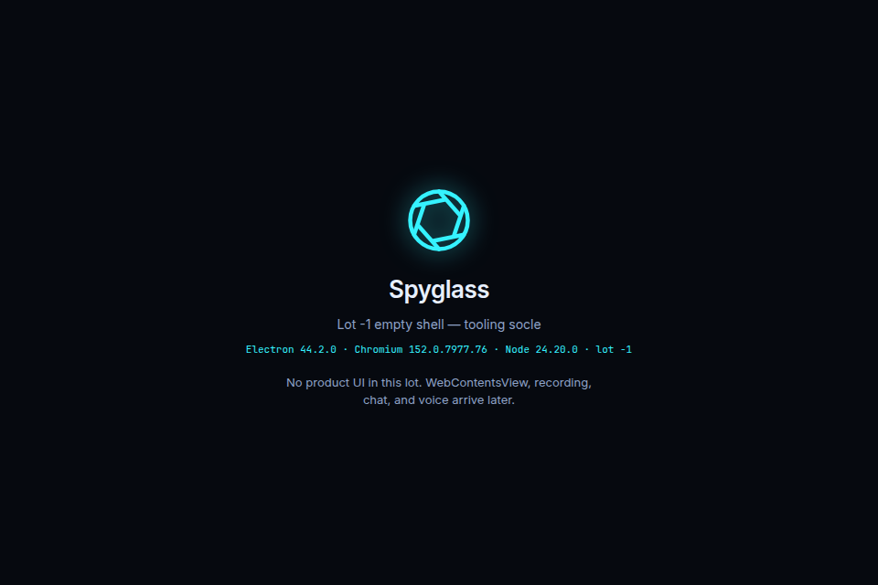

# Lot -1 evidence and PR notes

Do **not** open the pull request from this lot unless a human asks. This file
is the hand-off for a later PR.

## Screenshots (committed)

| Relative path | What it shows |
| --- | --- |
| [`screenshots/empty-electron-shell.png`](screenshots/empty-electron-shell.png) | Empty Electron window (Lot -1 shell, no product UI) |
| [`screenshots/e2e-empty-shell.png`](screenshots/e2e-empty-shell.png) | Same shell captured from Playwright e2e |
| [`screenshots/unit-tests.png`](screenshots/unit-tests.png) | lint + typecheck + vitest / ajv corpus |
| [`screenshots/ci-workflow.png`](screenshots/ci-workflow.png) | `.github/workflows/ci.yml` three-OS matrix |
| [`screenshots/linux-artifacts.png`](screenshots/linux-artifacts.png) | Unsigned AppImage + deb produced on Linux |

## Suggested PR title

```
feat(lot-1): freeze tooling socle — empty Electron app, CI, schemas
```

## Suggested PR body (paste)

Lot -1 (Socle d'outillage) only. Empty Electron app builds, tests, and packages
unsigned installers. JSON schema fixtures validate in CI. **No Lot 0+ product
features** (no WebContentsView split, Stagehand, recording, chat, or voice).

### Exit criteria (PRD §11 / §16)

- [x] Node 24.20.0 and Electron 44.2.0 frozen (`.nvmrc`, `engines`, README)
- [x] pnpm workspaces, `packageManager` pinned, `@spyglass/*` packages
- [x] Biome lint/format for all five packages
- [x] TypeScript `strict` / `noImplicitAny`
- [x] vitest smoke tests; contracts coverage threshold only
- [x] Playwright Electron smoke (built app; installer GUI e2e deferred)
- [x] ajv corpus: `docs/contracts/examples/{valid,invalid}`
- [x] electron-builder: Linux AppImage+deb, macOS dmg x64+arm64, Windows NSIS
- [x] Unsigned / not notarized documented (`docs/UNSIGNED-DISTRIBUTION.md`)
- [x] whisper.cpp + model-weight licences documented (`docs/LICENSES-whisper.md`)
- [x] GitHub Actions matrix on ubuntu, macos, windows

### Evidence


